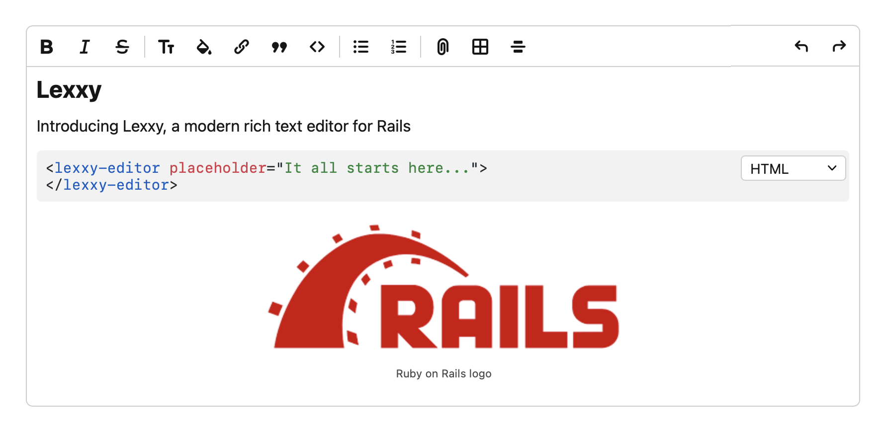

# Lexxy

A modern rich text editor for Rails.

> [!IMPORTANT]
> This is an early beta. It hasn't been battle-tested yet. Please try it out and report any issues you find.

## Features

- Built on top of [Lexical](https://lexical.dev), the powerful text editor framework from Meta.
- Good HTML semantics. Paragraphs are real `
` tags, as they should be.
- Markdown support: shortcuts, auto-formatting on paste.
- Real-time code syntax highlighting.
- Create links by pasting URLs on selected text.
- Configurable prompts. Support for mentions and other interactive prompts with multiple loading and filtering strategies.
- Preview attachments like PDFs and Videos in the editor.
- Works seamlessly with Action Text, generating the same canonical HTML format it expects for attachments.

## Documentation

For complete documentation, installation guides, and API reference, visit the **[Lexxy Documentation](https://basecamp.github.io/lexxy)**.

## Roadmap

This is an early beta. Here's what's coming next:

- [x] Configurable editors in Action Text: Choose your editor like you choose your database.
- [x] More editing features:
    - [x] Tables
    - [x] Text highlighting
- [x] Configuration hooks.
- [x] Standalone JS package: to use in non-Rails environments.
- [ ] Image galleries: The only remaining feature for full Action Text compatibility
- [ ] Install task that generates the necessary JS and adds stylesheets.

## Contributing

- Bug reports and pull requests are welcome on [GitHub Issues](https://github.com/basecamp/lexxy/issues). Help is especially welcome with [those tagged as "Help Wanted"](https://github.com/basecamp/lexxy/issues?q=is%3Aissue%20state%3Aopen%20label%3A%22help%20wanted%22).
- For questions and general Lexxy discussion, please use the [Discussions section](https://github.com/basecamp/lexxy/discussions)

## License

The gem is available as open source under the terms of the [MIT License](https://opensource.org/licenses/MIT).
