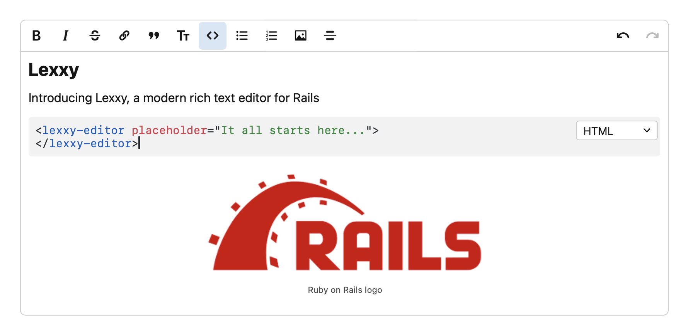

# Lexxy

A modern rich text editor for Rails.

{: .important }
> This is an early beta. It hasn't been battle-tested yet. Please try it out and report any issues you find.

## Features

- Built on top of [Lexical](https://lexical.dev), the powerful text editor framework from Meta.
- Good HTML semantics. Paragraphs are real `
` tags, as they should be.
- Markdown support: shortcuts, auto-formatting on paste.
- Real-time code syntax highlighting.
- Create links by pasting URLs on selected text.
- Configurable prompts. Support for mentions and other interactive prompts with multiple loading and filtering strategies.
- Preview attachments like PDFs and Videos in the editor.
- Works seamlessly with Action Text, generating the same canonical HTML format it expects for attachments.

